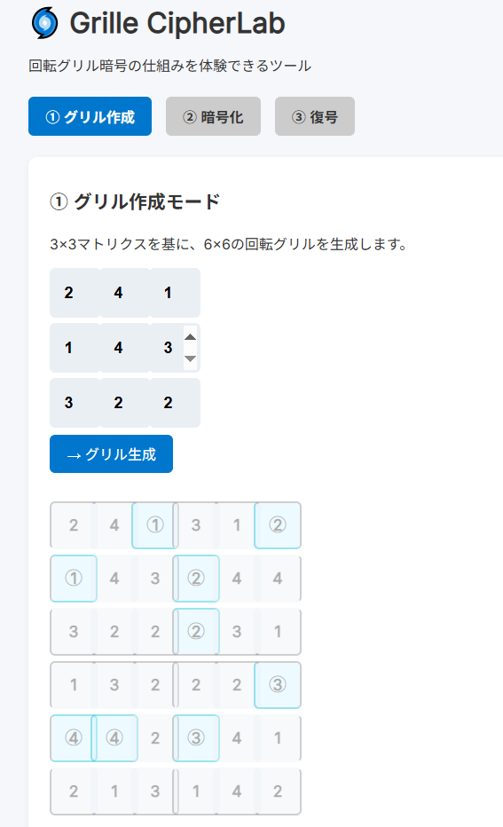

<!--
---
id: day024
slug: grille-cipherlab

title: "Grille CipherLab"

subtitle_ja: "回転グリル暗号の可視化ツール"
subtitle_en: "Rotating Grille Cipher Visualization Tool"

description_ja: "回転グリル暗号（Rotating Grille Cipher）の暗号化・復号プロセスをステップバイステップで視覚化する教育ツール。3×3マトリクスから6×6グリルを生成し、4回転で文字を配置する仕組みを直感的に理解できます。"
description_en: "An educational tool that visualizes the encryption and decryption process of the Rotating Grille Cipher step by step. Generate a 6×6 grille from a 3×3 matrix and intuitively understand how characters are placed through 4 rotations."

category_ja:
  - 古典暗号
  - 転置式暗号
category_en:
  - Classical Cryptography
  - Transposition Cipher

difficulty: 3

tags:
  - rotating-grille-cipher
  - visualization
  - cryptography-education

repo_url: "https://github.com/ipusiron/grille-cipherlab"
demo_url: "https://ipusiron.github.io/grille-cipherlab/"

hub: true
---
-->

# 🌀 Grille CipherLab - 回転グリル暗号の可視化ツール


**Day024 - 生成AIで作るセキュリティツール100**

**Grille CipherLab** は、古典暗号である回転グリル暗号（Rotating Grille Cipher）の仕組みを視覚的に体験できるWebツールです。

暗号化・復号の両モードに対応し、グリルの回転によってどのように文字が配置されるかを直感的に理解できます。

---

## 🌐 デモページ

👉 [https://ipusiron.github.io/grille-cipherlab/](https://ipusiron.github.io/grille-cipherlab/)

---

## 📸 スクリーンショット

>
>
>*3×3マトリクスからグリル（6×6マトリクス）を生成する様子*

---

## ✨ 主な特徴

### 🎯 *教育的視覚化
- **ステップバイステップ学習**: 暗号化・復号の各段階を詳細に表示
- **詳細進捗表示**: リアルタイム進捗バー、文字数カウンター、次ステップ予告
- **アニメーション効果**: グリルの回転と文字配置をリアルタイム表示
- **直感的インターフェイス**: タブ式UIで簡単操作

### 🔐 完全な機能実装
- **グリル生成**: 3×3マトリクスから6×6回転グリルを自動生成
- **暗号化モード**: 平文をグリルで段階的に暗号化
- **復号化モード**: 暗号文から元の平文を復元
- **カスタマイズ**: ユーザー定義のマトリクス値に対応

### ⌨️ 効率的操作
- **キーボードショートカット**: マウス不要の高速操作に対応
- **インテリジェント入力管理**: フォーカス状態に応じた適応的ショートカット
- **視覚フィードバック**: ショートカット実行時の即座な操作確認

### 🎨 視覚性とアクセシビリティ
- **ダークモード対応**: ライト・ダーク・システム連動の3つのテーマ
- **包括的ヘルプシステム**: 内蔵ヘルプモーダルでオフライン学習
- **直感的UI**: 分かりやすいアイコンとビジュアルフィードバック

### 🛡️ 信頼性の高い実装
- **包括的エラーハンドリング**: 入力検証と分かりやすいエラーメッセージ
- **堅牢な設計**: モジュラー構造による保守性の確保
- **ブラウザ対応**: モダンブラウザで動作（IE非対応）

---

## 🚀 使用方法

### 1. **グリル作成**
```
① グリル作成タブを選択
② 3×3マトリクスに値（1-4）を入力（デフォルト値あり）
③ 「→ グリル生成」ボタンをクリック
④ 6×6グリルプレビューを確認
```

### 2. **暗号化**
```
① ② 暗号化タブを選択
② 平文を入力（デフォルト: "HAPPY HOLIDAYS FROM THE HUNTINGTON FAMILY"）
③ 「暗号化開始」ボタンをクリック
④ 「▶進む」ボタンで各回転ステップを実行
⑤ 完成した暗号文をコピー
```

### 3. **復号化**
```
① ③ 復号タブを選択
② 暗号文を入力
③ 「復号開始」ボタンをクリック
④ 「▶進む」ボタンで各回転ステップを実行
⑤ 復号結果を確認
```

---

## ⌨️ キーボードショートカット

マウス操作なしで効率的に暗号化・復号作業が行えます：

### 📋 **ショートカット一覧**

| キー | 機能 | 使用場面 |
|------|------|----------|
| **Enter** | 開始ボタン | 全モード（グリル生成・暗号化開始・復号開始） |
| **スペース** | 進むボタン | 暗号化・復号化の各ステップ実行 |
| **Esc** | リセット | 現在のモードを初期状態に戻す |
| **Ctrl+C** | 暗号文コピー | 暗号化完了時の結果コピー |

### 🎮 **効率的操作フロー例**
```
1. Enter      → グリル生成
2. Tab        → 暗号化タブに移動  
3. Enter      → 暗号化開始
4. スペース×3  → 各ステップ実行
5. Ctrl+C     → 暗号文コピー
6. Tab        → 復号化タブに移動
7. Ctrl+V     → 暗号文貼り付け
8. Enter      → 復号開始
9. スペース×3  → 各ステップ実行
```

### 💡 **便利機能**
- **🎯 インテリジェント制御**: 入力フィールド中はショートカット自動無効化
- **👁️ 視覚フィードバック**: ショートカット実行時に操作確認メッセージ表示
- **❓ ヘルプ表示**: 「⌨️ ショートカット」ボタンで一覧確認

---

## 🎨 テーマとヘルプ機能

### 🌙 **ダークモード対応**

アプリケーション右上のテーマ切り替えボタンで、3つのテーマを選択できます：

| テーマ | アイコン | 説明 |
|--------|----------|------|
| **ライトモード** | ☀️ | 明るい配色テーマ |
| **ダークモード** | 🌙 | 目に優しい暗い配色テーマ |
| **システム連動** | 🔄 | OSの設定に自動追従 |

#### **特徴**
- **🎯 完全対応**: すべてのUI要素がテーマに対応
- **💾 設定保存**: ブラウザのlocalStorageに設定を記憶
- **⚡ 瞬時切り替え**: CSS変数による高速テーマ変更
- **🖥️ システム連動**: `prefers-color-scheme`で自動検出

### 📖 **包括的ヘルプシステム**

画面右上の❓ヘルプボタンから、詳細なヘルプモーダルにアクセスできます：

#### **ヘルプコンテンツ**
- **🌀 回転グリル暗号とは**: 基本概念と歴史的背景
- **📝 使い方**: 3つのモード（グリル作成・暗号化・復号化）の詳細手順
- **⌨️ キーボードショートカット**: 全ショートカットの一覧表
- **🎨 テーマ設定**: ダークモード機能の説明
- **💡 ヒント**: 効率的な使い方のコツ
- **🔗 詳細情報**: GitHubリポジトリへのリンク

#### **モーダル機能**
- **📱 レスポンシブ対応**: デスクトップ・モバイル両対応
- **📜 スクロール対応**: 長いコンテンツも快適に閲覧
- **⌨️ キーボード操作**: ESCキーで素早く閉じる
- **🖱️ 直感的操作**: オーバーレイクリック、×ボタンで閉じる
- **🎨 テーマ連動**: ダークモードにも完全対応

---

## 🗂️ プロジェクト構成

```
grille-cipherlab/
├── 📄 index.html                    # メインUI（タブベースインターフェース）
├── 🎨 style.css                     # 統合スタイルシート（アニメーション含む）
├── 📁 js/                           # JavaScript モジュール
│   ├── ⚙️ config.js                 # 統一設定ファイル
│   ├── 🚀 main-refactored.js        # メインアプリケーション制御
│   ├── 🔐 grille-cipher-logic.js    # 純粋な暗号化ロジック
│   ├── 📢 notification-system.js    # ユーザー通知システム
│   ├── 🖥️ ui-controller.js          # UI状態管理・描画制御
│   ├── ⌨️ keyboard-shortcuts.js     # キーボードショートカット管理
│   └── 🎨 theme-manager.js          # ダークモードテーマ管理
├── 📁 assets/                       # スクリーンショット等
├── 🤖 CLAUDE.md                     # Claude Code開発ガイド
└── 📄 README.md                     # このファイル
```

---

## 🌀 回転グリル暗号とは

**回転グリル暗号（Rotating Grille Cipher）** は、グリル（ステンシルとも呼ぶ）と呼ばれる穴あきの型紙（カード）を使って文字を配置し、一定回転ごとに順に文字を埋めていくことで暗号文を作成する **転置式暗号** の一種です。

本ツールのグリルは6×6マトリクスですが、他の大きさのものもあります。
とくに長い平文を暗号化するには、大きなものが必要になります。

---

### 📜 歴史的背景
16世紀後半〜18世紀ごろ、ヨーロッパで実際に使われた歴史があり、ルネサンス期の秘密通信や軍事連絡でも活用されました。

---

### ⚙️ グリルの特徴

グリルに対して4種類（0度、90度、180度、270度）の回転を適用することで、平文をうまくシャッフルして、ランダムに見える暗号文を作ります。

ところで、グリルの穴は適当に設定されているわけではありません。
4種類（0度、90度、180度、270度）の回転で、穴の位置が重複しないように設計されています。

グリルの穴の位置が鍵に相当します。
ただし、6×6マトリクスのグリルは3×3マトリクスから作られており、その3×3マトリクスには1から4までがランダムに埋められています。 つまり、この数値の配置こそが本質的な鍵になります。

---

### 🔧 回転グリル暗号の仕組み

#### **1. グリル生成プロセス**

- **6×6マトリクス**: 36マスの正方格子
- **3×3ベース**: 基本パターンは3×3マトリクス（値1-4）
- **4回転設計**: 0°、90°、180°、270°で穴が重複しない配置

#### **2. 暗号化プロセス**
```
Step 1: グリルを0°で配置 → 平文の1/4を穴に配置
Step 2: グリルを90°回転 → 平文の2/4を穴に配置  
Step 3: グリルを180°回転 → 平文の3/4を穴に配置
Step 4: グリルを270°回転 → 平文の4/4を穴に配置
→ 完成したマトリクスを行順に読んで暗号文とする
```

#### **3. 復号化プロセス**
```
Step 1: 暗号文を6×6マトリクスに配置
Step 2: 各回転角度でグリルを重ね、穴の文字を順次抽出
→ 抽出順序が平文の復元順序
```

---

### 🧮 数学的特性

- **完全性**: 4回転で全36マスを使用（穴の重複なし）
- **対称性**: 各回転で同じ数の穴（通常9個）
- **鍵空間**: 3×3マトリクスの配置パターン数

---

## 🔍 回転グリル暗号 vs. カルダン・グリル暗号

回転グリル暗号ではグリル（穴が開いているカード）を用いましたが、同様にグリフを用いるまったく別種の暗号もあります。

カルダン・グリフ暗号は、グリルを回転させずに、穴に1文字ずつ平文を書き込み、残りの箇所には不自然にならないように作文して暗号文を作る手法です。
うまく作文できれば、ステガノグラフィーの効果も得られます。

| 比較項目 | 回転グリル暗号 | カルダン・グリル暗号 |
|----------|----------------|----------------------|
| **分類** | 転置式暗号 | 隠蔽式暗号 |
| **回転** | 必須（90°×4回） | 回転しない |
| **目的** | 文字順序の攪拌 | 秘密文の隠蔽 |
| **見た目** | 無意味な文字列 | 自然な文章風 |
| **グリル形状** | 正方形必須 | 任意形状可 |
| **歴史** | 16-18世紀軍事用 | 16世紀詩文用 |

---

## 📘 関連図書

- 『暗号解読 実践ガイド』IPUSIRON著（マイナビ）
    - P.249-273：第11章「回転グリル暗号」
    - 本ツールのデフォルト平文"HAPPY HOLIDAYS FROM THE HUNTINGTON FAMILY"は、書籍P.251に登場するものです。

---

## 💻 プログラミング技術の詳細

### 🏗️ **アーキテクチャの特徴**

- **📦 モジュラー設計**: 機能別に分離されたJavaScriptモジュール
- **⚙️ 統一設定管理**: `config.js`による中央集権的設定
- **🎮 高度なUX**: キーボードショートカット、リアルタイム進捗、アニメーション
- **🛡️ 堅牢性**: 包括的エラーハンドリングと入力検証
- **🎯 イベント駆動**: 効率的な状態管理とUI更新

### 🔧 **技術的ハイライト**

- **インテリジェントキーボード制御**: フォーカス状態に応じた適応的ショートカット
- **リアルタイム進捗可視化**: 動的プログレスバーと詳細統計
- **CSS Grid + アニメーション**: 流麗な回転エフェクトとセル操作
- **ダークモードシステム**: CSS変数による包括的テーマ管理
- **モーダルインターフェース**: スクロール対応のヘルプシステム
- **設定の不変性**: Object.freeze()による設定保護
- **メモリ効率**: 適切なイベントリスナー管理

👉 [technical_info.md（詳細技術解説）](technical_info.md)

---

## 🛠️ 開発・カスタマイズ

### 環境要件
- モダンブラウザー（ES6+対応）
- HTMLファイルサーバー（開発時）

---

### ローカル実行
```bash
# シンプルなHTTPサーバーで実行
python -m http.server 8000
# または
npx serve .
```

---
### カスタマイズポイント

- **グリルサイズ変更**: `CONFIG.GRILLE_SIZE`定数を変更
- **アニメーション速度**: `CONFIG.ANIMATION_DURATION`を調整
- **キーボードショートカット**: `CONFIG.KEYBOARD_SHORTCUTS`でキー割り当て変更
- **進捗表示設定**: `CONFIG.NOTIFICATION_DURATION`で表示時間調整
- **初期マトリクス値**: `CONFIG.DEFAULT_BASE_MATRIX`を変更

---

## 📄 ライセンス

MIT License - 詳細は[LICENSE](LICENSE)をご覧ください。

---

## 🛠 このツールについて

本ツールは、「生成AIで作るセキュリティツール100」プロジェクトの一環として開発されました。
このプロジェクトでは、AIの支援を活用しながら、セキュリティに関連するさまざまなツールを100日間にわたり制作・公開していく取り組みを行っています。

プロジェクトの詳細や他のツールについては、以下のページをご覧ください。

🔗 [https://akademeia.info/?page_id=42163](https://akademeia.info/?page_id=42163)
