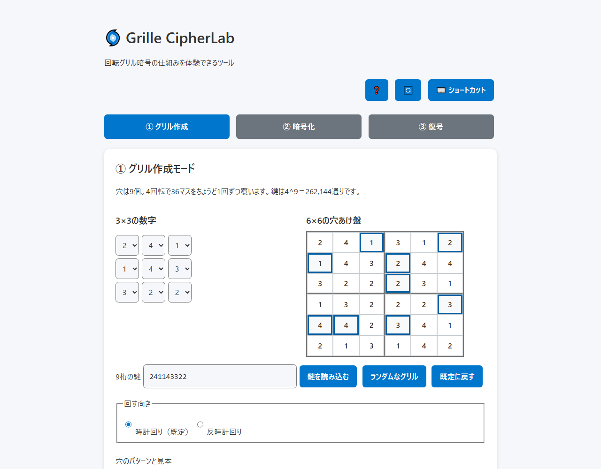
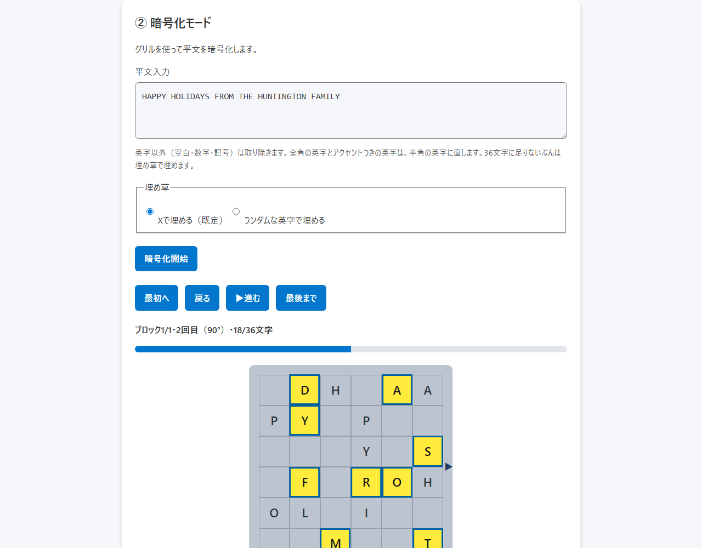
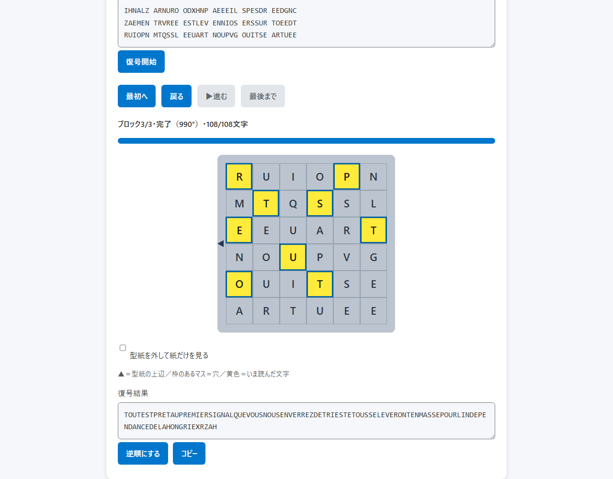
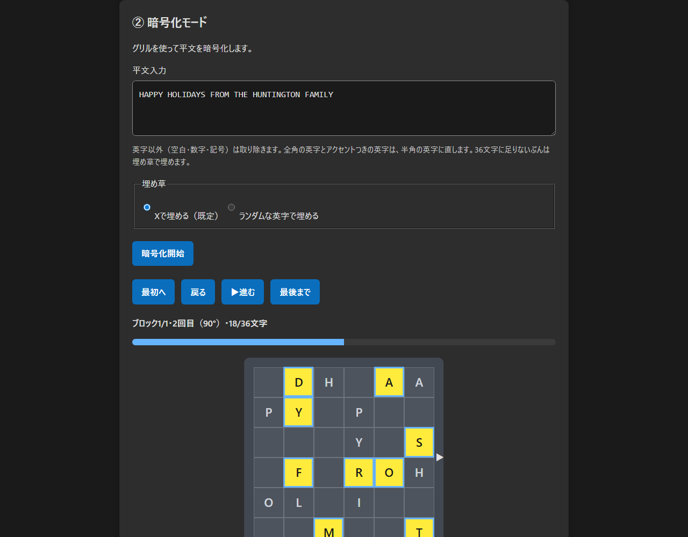
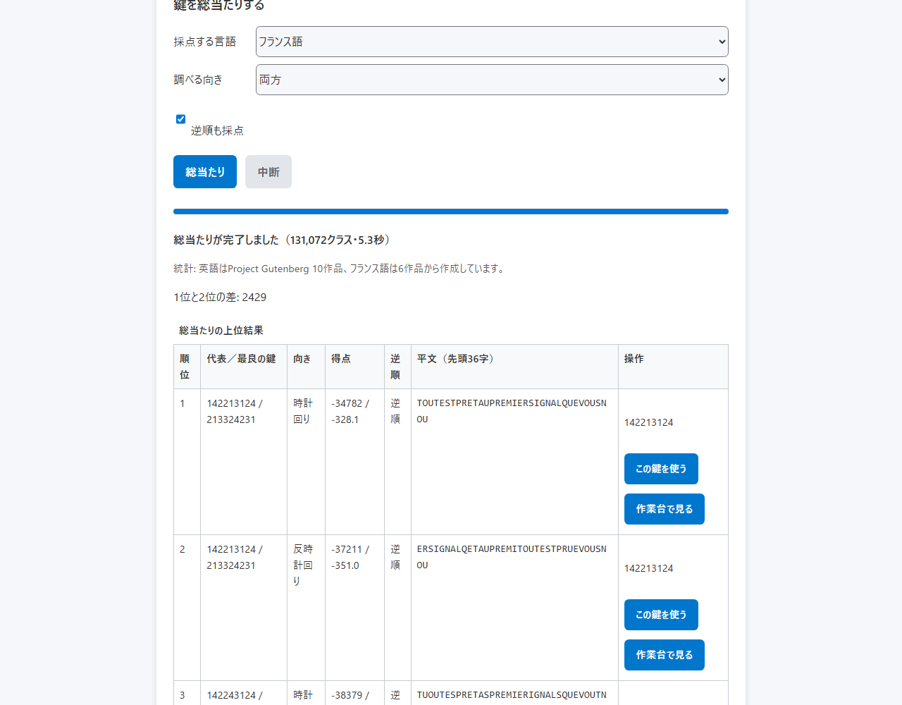
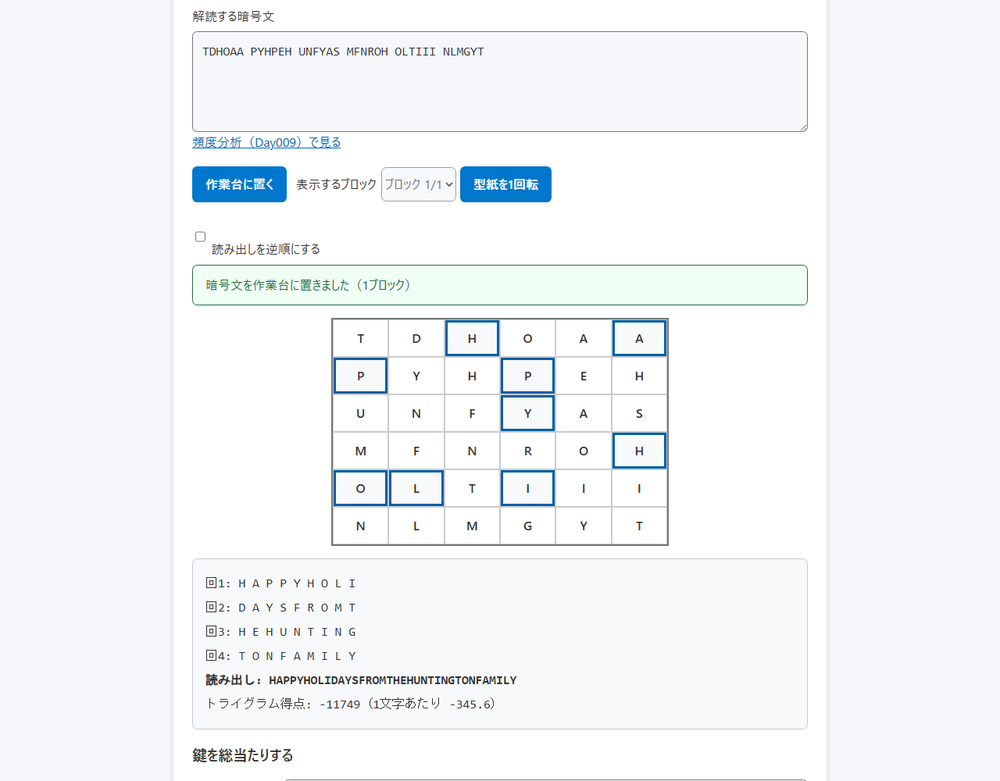
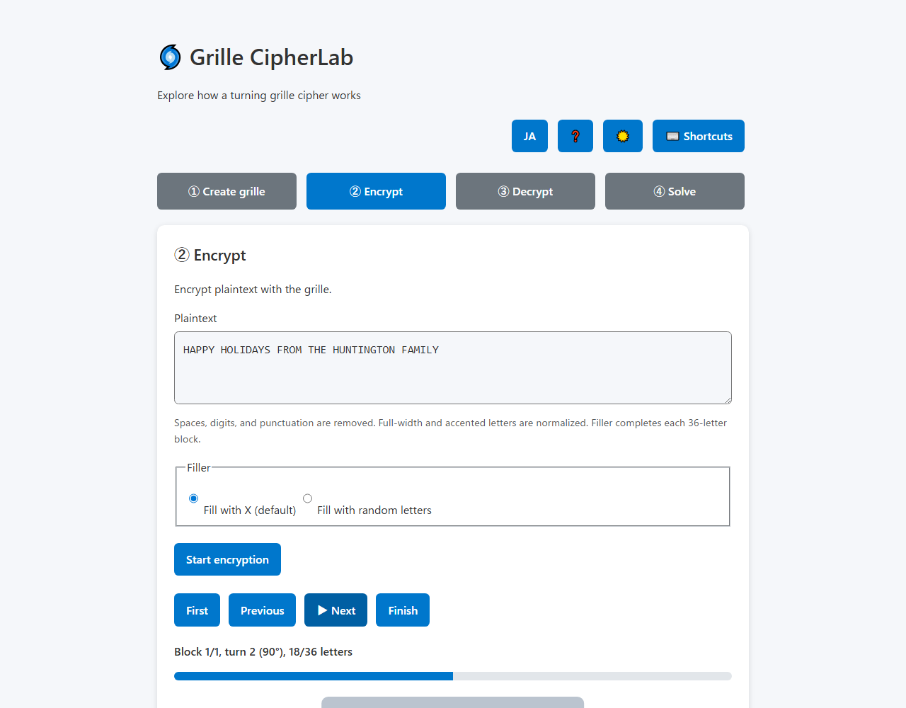

<!--
---
id: day024
slug: grille-cipherlab

title: "Grille CipherLab"

subtitle_ja: "回転グリル暗号の可視化ツール"
subtitle_en: "Rotating Grille Cipher Visualization Tool"

description_ja: "回転グリル暗号の作成・暗号化・復号・解読を体験し、印刷や鍵の共有もできる日英対応の学習ツール。"
description_en: "A bilingual learning tool for creating, encrypting, decrypting, solving, printing, and sharing turning grilles."

category_ja:
  - 古典暗号
  - 転置式暗号
category_en:
  - Classical Cryptography
  - Transposition Cipher

difficulty: 3

tags:
  - rotating-grille-cipher
  - visualization
  - cryptography-education
  - brute-force
  - i18n

repo_url: "https://github.com/ipusiron/grille-cipherlab"
demo_url: "https://ipusiron.github.io/grille-cipherlab/"

hub: true
---
-->

[English](README.en.md) · 日本語

# 🌀 Grille CipherLab - 回転グリル暗号の可視化ツール


[](https://ipusiron.github.io/grille-cipherlab/)

**Day024 - 生成AIで作るセキュリティツール100**

**Grille CipherLab**は、穴の開いた型紙を回して文字を配置する回転グリル暗号を体験するWebツールです。鍵の編集、暗号化・復号に加え、手作業の解読とトライグラム統計による総当たりを試せます。印刷、URL共有、日英表示にも対応しています。

## 🌐 デモページ

👉 [https://ipusiron.github.io/grille-cipherlab/](https://ipusiron.github.io/grille-cipherlab/)

## 📸 スクリーンショット



> *既定の鍵を、3×3の数字・6×6の穴あけ盤・9桁の鍵で表示した状態。*



> *書籍の例を暗号化し、型紙を90°まで回した2回目の状態。*



> *サンドルフの暗号文を最後まで復号し、結果を逆順にした状態。*



> *ダークモードで書籍の例を暗号化した2回目の状態。*



> *サンドルフの暗号文を仏語・両方向・逆順ありで総当たりし、正解のクラスが1位になった状態。*



> *書籍の暗号文を6×6の作業台へ置き、4回転ぶんの読み出しを確認した状態。*



> *英語表示で書籍の例を暗号化し、型紙を90°まで回した2回目の状態。*

## ✨ 主な機能

- 3×3の数字・6×6の穴あけ盤・9桁の鍵・穴のパターンによる鍵の編集
- 時計回り・反時計回りの暗号化と復号
- 36文字を超える平文の複数ブロック処理
- Xまたはランダムな英字による埋め草
- 「最初へ」「戻る」「進む」「最後まで」による段階表示
- 書籍の例・ヴェルヌの既知解答・短い文の見本
- 穴を動かしながら4回転の読み出しを確認する解読作業台
- 英語・フランス語のトライグラム統計による65,536クラスの総当たり
- 18mm角の型紙と空の用紙の印刷
- 鍵と向きだけを含む共有URL
- Day009の頻度分析ツールへの暗号文の受け渡し
- 日本語・英語の表示切り替え
- ライト・ダーク・システム連動のテーマ
- キーボード操作と幅320pxまでのレスポンシブ表示

## 📖 使い方

### 1. グリルを決める

「グリル作成」タブで、3×3の数字を選ぶ、6×6のマスを押す、9桁の鍵を読み込む、または`X`と`.`の穴のパターンを読み込む方法から選びます。「見本」から既知の鍵も読み込めます。向きは時計回りが既定です。

### 2. 暗号化する

「暗号化」タブで平文と埋め草を指定し、「暗号化開始」を押します。「進む」で型紙を回し、「戻る」「最初へ」「最後まで」で状態を移動できます。「型紙を外して紙だけを見る」により、行順に読む暗号文を確認できます。

### 3. 復号する

「復号」タブへ36文字の倍数の暗号文を入れ、「復号開始」を押します。暗号化と同じ操作で穴の文字を読みます。ヴェルヌの見本では、完了後に「逆順にする」を押すと小説の平文順になります。

### 4. 解読する

「解読」タブへ暗号文を入れ、「作業台に置く」を押します。6×6の穴を動かすと、現在の鍵による4回転の読み出しと得点がその場で変わります。「総当たり」では言語・回す向き・逆順の採点を指定し、上位10クラスから鍵を作業台または復号タブへ移せます。

## 🔑 鍵の表し方

3×3の各数字は、対応する4マスのどこを穴にするかを表します。1は左上、2は右上、3は右下、4は左下です。9桁の鍵は3×3を行順に並べたもの、穴のパターンは`X`が穴です。6×6の穴あけ盤を直接押しても、同じ鍵の別表現が更新されます。

| 名前 | 鍵（9桁） | 穴のパターン |
|---|---:|---|
| 既定（書籍の例） | 241143322 | ..X..X⏎X..X..⏎...X..⏎.....X⏎XX.X..⏎...... |
| ヴェルヌ『Mathias Sandorf』 | 213324231 | .X.X.X⏎....X.⏎..X...⏎.X..X.⏎.....X⏎...X.. |

4回転で重なる4マスのうち、穴にできるのは1つだけです。6×6にはそのような組が9つあるため、穴は9個、鍵は4^9＝262,144通りです。

## 🧩 例で確かめる

埋め草をXにした暗号化の例です。

| 平文 | 鍵 | 向き | 埋め草 | 暗号文 |
|---|---:|---|---:|---|
| HAPPY HOLIDAYS FROM THE HUNTINGTON FAMILY | 241143322 | 時計回り | 0文字 | TDHOAA PYHPEH UNFYAS MFNROH OLTIII NLMGYT |
| HAPPY HOLIDAYS FROM THE HUNTINGTON FAMILY | 241143322 | 反時計回り | 0文字 | DTHAOA PNHPEH UYSYFF RANMIH OLTIOI NMLGTY |
| ATTACK AT DAWN | 241143322 | 時計回り | 24文字 | XAAXWT TNXAXX XXXCXX XXXXXK ATXDXX XXXXXX |
| （サンドルフの逆順の108文字） | 213324231 | 時計回り | 0文字 | IHNALZ ARNURO ODXHNP AEEEIL SPESDR EEDGNC⏎ZAEMEN TRVREE ESTLEV ENNIOS ERSSUR TOEEDT⏎RUIOPN MTQSSL EEUART NOUPVG OUITSE ARTUEE |

`ATTACK AT DAWN`を復号すると`ATTACKATDAWNXXXXXXXXXXXXXXXXXXXXXXXX`になります。末尾のXは埋め草であり、どこまでが本文かを判断して取り除くのは受け取った人の役目です。

ヴェルヌ『Mathias Sandorf』に出る18語は、1列を1ブロックとして次のように並びます。

```text
ihnalz zaemen ruiopn
arnuro trvree mtqssl
odxhnp estlev eeuart
aeeeil ennios noupvg
spesdr erssur ouitse
eedgnc toeedt artuee
```

| ブロック | 0° | 90° | 180° | 270° |
|---:|---|---|---|---|
| 1 | HAZRXEIRG | NOHALEDEC | NADNEPEDN | ILRUOPESS |
| 2 | AMNETNORE | VELESSUOT | ETSEIRTED | ZERREVNES |
| 3 | UONSUOVEU | QLANGISRE | IMERPUATE | RPTSETUOT |

小説では、型紙を「de gauche à droite」（時計回り）に4分の1ずつ回して読みます。読み出した108文字を最後の文字から逆に読むと、「Tout est prêt. Au premier signal que vous nous enverrez de Trieste, tous se lèveront en masse pour l'indépendance de la Hongrie. Xrzah.」になります。末尾のXrzahは小説では取り決めた署名ですが、103文字の文を108文字にそろえる役も果たしています。

本ツールでは、見本「ヴェルヌ『Mathias Sandorf』」を読み込み、復号して「逆順にする」を押すと再現できます。電子テキストや解説サイトには18語目に誤植のある版があります。本ツールのテストは、平文から逆算した上表の18語目で平文と一致することを確かめています。出所は[原文の電子テキスト](http://jv.gilead.org.il/ebooksgratuits/jules_verne_mathias_sandorf.html)です。

## 🔓 解読を試す

同じ型紙を90°ずつ回した4つの鍵は、読み始める回転だけが違う同値な鍵です。総当たりでは262,144鍵を65,536クラスにまとめ、各クラスで最も高い得点を表示します。ヴェルヌ『Mathias Sandorf』の本文は読み出した文字列を逆順にするため、「逆順も採点」を使います。

| 暗号文 | 言語 | 1位の代表／最良の鍵 | 得点 | 逆順 |
|---|---|---|---:|---|
| TDHOAA PYHPEH UNFYAS MFNROH OLTIII NLMGYT | 英語 | 134432211／312214433 | -11694 | なし |
| XAAXWT TNXAXX XXXCXX XXXXXK ATXDXX XXXXXX | 英語 | 134432211／241143322 | -16400 | なし |
| IHNALZ…ARTUEE（108文字） | フランス語 | 142213124／213324231 | -34782 | あり |

英語モデルはDay018 Cipher ClimbのProject Gutenberg 10作品・5,141,270字、フランス語モデルはProject Gutenberg 6作品・3,228,303字から作成したトライグラム統計です。総当たりは候補を順位づけする学習機能であり、「正解が見つからない」と判定する閾値は設けていません。

## ⌨️ キーボードショートカット

| キー | 機能 | 条件 |
|---|---|---|
| Enter | 暗号化・復号を開始 | 暗号化または復号タブ |
| Space／→ | 1回進む | 進行中 |
| ← | 1回戻る | 1回以上進行済み |
| Esc | 最初へ戻る | 入力した文・鍵・見本は保持 |
| Ctrl+C | 暗号文をコピー | 暗号化完了後、文字の選択範囲がないとき |

タブにフォーカスを置くと、←→・Home・Endでタブを選択できます。フォーカスがボタンや入力欄にあるときは、その要素の標準操作が優先されます。Escは進行を最初へ戻すだけで、入力した文は消しません。

## 🎨 テーマとヘルプ

右上のテーマボタンは、ライト・ダーク・システム連動の順に切り替わります。EN／JAボタンは画面・ヘルプ・動的な結果を日本語と英語の間で切り替えます。保存できる環境ではテーマと言語をlocalStorageへ保存します。❓は使い方、⌨️は同じヘルプのショートカット欄を開きます。Esc・閉じるボタン・背景のクリックで閉じ、開いたボタンへフォーカスが戻ります。

## 🌀 回転グリル暗号とは

回転グリル暗号は、穴の開いた型紙を一定角度ずつ回し、平文を紙へ配置する転置式暗号です。暗号文は紙を行順に読んで作り、復号は同じ鍵と向きで穴の文字を読みます。

[Grille (cryptography)](https://en.wikipedia.org/wiki/Grille_(cryptography))によると、1745年にはオランダ総督ウィレム4世の行政でグリルの使用例があり、1796年にはC. F. Hindenburgが回転グリルを体系的に研究したとされます。フライスナーが1880年に解説し、1881年に著書を出版しましたが、1809年にテュービンゲンで出版された先行文献を主な材料にしていました。このためフライスナー・グリルとも呼ばれますが、フライスナー自身の考案ではありません。1885年にはジュール・ヴェルヌが小説に採用しました。

同資料によると、第一次世界大戦末の1916年にドイツ陸軍はANNA・BERTA・CLARA・DORA・EMIL・FRANZという6種類の大きさを採用しましたが、安全性が弱く約4か月で廃止されました。短い文はnull letters、すなわち埋め草で満たしたとされます。

暗号化では36文字に足りないぶんを埋め草で補い、36文字を超えたら同じ型紙で次の紙へ続けます。

- 完全性: 4回転で全36マスをちょうど1回ずつ使う
- 穴の数: どの鍵でも9個
- 鍵空間: 4^9＝262,144通り。計算機なら総当たりできる大きさで、現代の暗号としては安全ではない
- 転置の性質: 文字の出現回数は平文と変わらない

## 🔍 回転グリル暗号 vs. カルダン・グリル暗号

回転グリル暗号が型紙を回して文字順を入れ替えるのに対し、カルダン・グリル暗号は型紙を回さず、穴へ秘密文を書いて残りを自然な文章で埋めます。[Cardan grille](https://en.wikipedia.org/wiki/Cardan_grille)によると、カルダーノは1550年に秘密文を書く格子を提案しました。

| 比較項目 | 回転グリル暗号 | カルダン・グリル暗号 |
|---|---|---|
| 分類 | 転置式暗号 | 隠蔽式暗号 |
| 回転 | 90°ずつ4回 | 回転しない |
| 目的 | 文字順序の攪拌 | 秘密文の隠蔽 |
| 見た目 | 無意味な文字列 | 自然な文章風 |
| グリル形状 | 正方形 | 任意形状 |
| 歴史 | 18世紀に使用例、1881年にフライスナーが解説、第一次世界大戦でドイツ陸軍が採用 | 1550年にカルダーノが提案 |

## 📘 関連図書

- 『暗号解読実践ガイド』IPUSIRON著（マイナビ）
  - P.249-273: 第11章「回転グリル暗号」
  - 既定の平文`HAPPY HOLIDAYS FROM THE HUNTINGTON FAMILY`はP.251の例

## 🔬 技術的な説明

暗号ロジックはDOMに依存しない`GrilleLogic`へ分離しています。暗号化・復号の画面状態は「済んだ回数」`done`を1つ持ち、`encryptionView`と`decryptionView`がその値から毎回表示内容を導きます。紙の文字は固定し、型紙だけをCSSの`transform`で回します。

解読は`GrilleSolver`が担当します。トライグラムの出現確率の常用対数を100倍して丸め、未出現の並びには言語ごとのfloor値を使います。ブラウザーでは4,096鍵ずつ分割して処理するため、進捗の更新と中断ができます。

1つの鍵から、3×3の数字・6×6の穴あけ盤・9桁の鍵・穴のパターンを描きます。表示サイズは6×6に固定しており、大きさの変更には対応していません。詳しくは[technical_info.md](technical_info.md)を参照してください。

## 🖨️ 印刷して使う

「型紙を印刷」は、18mm角の6×6型紙と空の用紙だけを印刷します。型紙の黒い9マスを切り抜き、用紙の▲を上にして重ねると紙でも4回転を試せます。ブラウザーの印刷設定では倍率100%を選び、プレビューで1マス18mmになることを確認してください。

## 🔗 鍵の共有とDay009との連携

「共有URLをコピー」は、`#k=241143322&d=cw`のように鍵と向きだけをハッシュへ入れます。平文と暗号文はURLへ含めません。

回転グリル暗号は文字の位置だけを入れ替える転置暗号なので、暗号文の文字頻度は平文と同じです。「頻度分析（Day009）で見る」から暗号文を渡すと、英語のE・T・Aなどの頻度に近いかを確認でき、換字暗号との違いを観察できます。リンクを開くまでは外部通信を行いません。

## 🔒 セキュリティ

- CSPとreferrer policyをmeta要素で設定
- 外部API・CDN・Webフォントへの通信なし
- 利用者の入力は`textContent`またはフォームの`value`で表示
- localStorageへ保存するのはテーマと言語だけ
- ランダムな鍵と埋め草は`crypto.getRandomValues`を使用
- 外部リンクに`rel="noopener noreferrer"`を指定

meta要素のCSPでは`frame-ancestors`を指定できないため、クリックジャッキング対策には配信サーバー側のHTTPヘッダーが必要です。また、回転グリル暗号は学習用であり、実際の秘匿には使用できません。

## 🧪 テスト

Node.js 22以上で次を実行します。npm依存パッケージはありません。

```console
npm test
```

`node --test`で、全262,144鍵、暗号化と復号の往復、画面状態、CSP・ARIA、コントラスト、READMEの表、ヴェルヌの既知解答を検証します。第2弾では`ngram.test.js`・`solver.test.js`・`share.test.js`・`i18n.test.js`も加え、統計モデル、総当たり順位、共有URL、日英辞書と英語READMEを照合します。GitHub Actionsでもpushとpull_requestのたびに実行します。

## 📁 ディレクトリー構造

```text
grille-cipherlab/                      # 回転グリル暗号の仕組みを体験するWebツール
├── .github/                           # GitHubの設定
│   └── workflows/                     # GitHub Actionsのワークフロー
│       └── test.yml                   # pushとpull_requestでnpm testを実行
├── .gitignore                         # Git管理から除外するファイルの指定
├── .nojekyll                          # PagesのJekyll処理を無効化
├── assets/                            # ファビコンとREADMEに載せる画像
│   ├── favicon.svg                    # ファビコン（型紙と3つの穴）
│   ├── screenshot.png                 # グリル作成タブ（3×3の数字・6×6の穴あけ盤・鍵）
│   ├── screenshot2.png                # 暗号化タブ（書籍の例の2回目。型紙が90°回った状態）
│   ├── screenshot3.png                # 復号タブ（サンドルフの見本を最後まで復号し、逆順にした状態）
│   ├── screenshot4.png                # ダークモードの暗号化タブ
│   ├── screenshot5.png                # 解読タブ（サンドルフの総当たり。1位が正解のクラス・逆順）
│   ├── screenshot6.png                # 解読タブの作業台（書籍の暗号文と4回転ぶんの読み出し）
│   └── screenshot7.png                # 英語表示（English UI）の暗号化タブ
├── CLAUDE.md                          # AI向けの開発ガイド
├── index.html                         # 画面のマークアップ（4タブ、ヘルプ、印刷用の型紙）
├── js/                                # JavaScript（classic script。読み込み順はindex.htmlの末尾）
│   ├── config.js                      # 画面側の定数（要素のid・CSSのクラス名・保存キー）
│   ├── grille-cipher-logic.js         # 画面に依存しない純粋なロジック（鍵・穴・暗号化・復号・画面の状態。Nodeのテストからも読む）
│   ├── grille-solver-logic.js         # 解読のロジック（同値クラス・採点・作業台・総当たり）
│   ├── ngram-models.js                # 採点用の文字トライグラム統計（英語・フランス語。自動生成）
│   ├── share.js                       # URLの鍵（#k=…&d=…）の読み書き
│   ├── keyboard-shortcuts.js          # キーボードショートカット（操作要素にフォーカスがないときだけ効く）
│   ├── main-refactored.js             # 初期化とイベントの登録（共有・言語切り替えを含む）
│   ├── messages.js                    # 画面の文言の日英辞書と、キーから文を作る関数
│   ├── notification-system.js         # 通知の表示（role="status"の欄へtextContentで出す）
│   ├── samples.js                     # 見本3件（書籍の例・サンドルフ・短い文）
│   ├── theme-manager.js               # ライト・ダーク・システム連動の切り替えと保存
│   └── ui-controller.js               # 画面の状態と描画（作業台・総当たり結果を含む）
├── LICENSE                            # MITライセンス
├── package.json                       # 依存なしのnpm test定義
├── README.md                          # 本ドキュメント（日本語）
├── README.en.md                       # 英語版のドキュメント
├── style.css                          # 配色・レスポンシブレイアウト・印刷用の型紙
├── technical_info.md                  # 実装の技術メモ（READMEの「技術的な説明」の詳細）
└── test/                              # node --testの自動テスト（依存なし）
    ├── contrast.test.js               # 文字色と面のコントラストの検証（型紙の下の文字を含む）
    ├── format.test.js                 # 行長と読みやすさの検証
    ├── html.test.js                   # CSP・ARIA・id・インライン属性なしの検証
    ├── i18n.test.js                   # 日本語と英語の辞書、README.en.mdの検証
    ├── logic.test.js                  # 鍵・穴・正規化・暗号化・復号・往復・全262,144鍵の検証
    ├── messages.test.js               # 文言の辞書と、画面側が使うキーの検証
    ├── ngram.test.js                  # トライグラム統計の値・出所・ハッシュの検証
    ├── readme.test.js                 # 表・画像・ツリー・YAMLの検証
    ├── samples.test.js                # 見本とヴェルヌの既知解答の検証
    ├── share.test.js                  # URLの鍵の読み書きの検証
    ├── solver.test.js                 # 同値クラス・採点・総当たり・作業台の検証
    ├── static.test.js                 # 純粋性・禁止している書き方・CI設定の検証
    └── views.test.js                  # 画面の状態（済んだ回数から描く内容）の検証
```

## 💻 動作環境

最新のChromiumでHTTP配信と`file://`からの直接表示を確認しています。外部通信はありません。ローカルサーバーを使う場合は、リポジトリーのルートで次を実行します。

```console
python -m http.server 8000
```

## 📄 ライセンス

MIT Licenseです。詳細は[LICENSE](LICENSE)を参照してください。

## 🛠️ このツールについて

本ツールは、「生成AIで作るセキュリティツール100」プロジェクトの一環として開発されました。
このプロジェクトでは、AIの支援を活用しながら、セキュリティに関連するさまざまなツールを100日間にわたり制作・公開していく取り組みを行っています。

プロジェクトの詳細や他のツールについては、以下のページをご覧ください。

🔗 [https://akademeia.info/?page_id=42163](https://akademeia.info/?page_id=42163)
